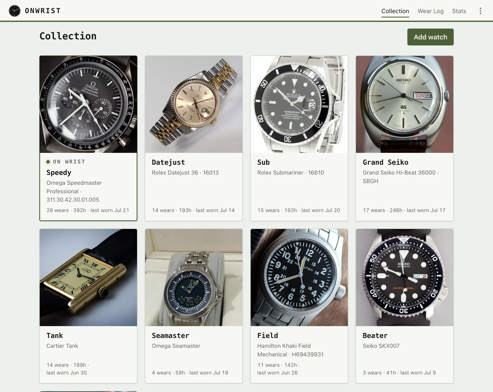

# onwrist

A self-hosted, multi-tenant watch-collection tracker: self-serve accounts,
inventory management, low-friction wear-session logging via an installable
PWA, and a stats dashboard (day-of-week, time-of-day, total wear,
cost-per-wear, calendar views). One SvelteKit app container + Postgres,
run with docker compose.



## What you need

- **Docker** on the box that will run it (a homelab server, a VPS, a NAS —
  anything).
- That's it to try it out. For a *real* deployment you'll also want:
  - **[Resend](https://resend.com) API key + verified sender domain** —
    account emails (verify, password reset). Without it, those emails are
    printed to the container's logs instead of sent: fine for yourself,
    not for other users.
  - **[Cloudflare Turnstile](https://developers.cloudflare.com/turnstile/)
    keys** (free) — the signup captcha. It fails closed, so signup is
    disabled until keys are set; the quickstart below uses Cloudflare's
    public always-pass test keys so you can kick the tires first.
  - **HTTPS in front** if you expose it to the internet — a reverse proxy
    or a Cloudflare tunnel (see "Exposing it" below).

## Quickstart

```sh
git clone https://github.com/jdstemmler/onwrist.watch.git && cd onwrist.watch
cp .env.example .env
# edit .env — required:
#   POSTGRES_PASSWORD  any strong value
#   ORIGIN             the exact URL you'll open the app from,
#                      e.g. http://192.168.1.50:3000
# to try it out, enable signup with Cloudflare's always-pass TEST keys:
#   TURNSTILE_SITE_KEY=1x00000000000000000000AA
#   TURNSTILE_SECRET_KEY=1x0000000000000000000000000000000AA
mkdir -p data && sudo chown -R 1000:1000 data   # app runs as uid 1000
docker compose up -d
```

Open `ORIGIN` in a browser and **sign up**. With `RESEND_API_KEY` unset,
the verification link is printed to the app's logs instead of emailed:

```sh
docker compose logs onwrist | grep http
```

Sessions last 30 days (sliding), so your phone stays logged in.

Before real users touch it, swap the Turnstile test keys for real ones and
set `RESEND_API_KEY` + `MAIL_FROM` — the test keys let **any** bot sign up,
and logged-not-sent emails mean nobody else can verify or reset a password.

**Admin console (optional):** set `ADMIN_EMAIL` in `.env` before first
boot. One admin-role account is seeded at that address; set its password
via the ordinary forgot-password flow at `/reset` (the link lands in the
logs or your inbox, same as above). `/admin` gives you user management
(disable, delete, quotas, resend verification).

## Logging wear from your phone

Open `/log` in your phone's browser and **Add to Home Screen**. The
installed app opens straight to the wear log: current on-wrist state,
one-tap put-on / swap / take-off, backfill, and inline corrections. That's
the whole workflow — no companion app needed.

## Exposing it to the internet

Any HTTPS reverse proxy works. Two things matter regardless of which:

1. `ORIGIN` must be the exact public URL (scheme + host), or every form
   POST is rejected as cross-site.
2. Client IPs: by default the app rate-limits by the connecting socket's
   address. Behind a proxy every request arrives from the proxy's address,
   collapsing all visitors into one rate-limit bucket — set
   `ADDRESS_HEADER` to a header your proxy **always overwrites** (and make
   the proxy the only path to the port), or leave rate limiting degraded
   at your own risk.

**Cloudflare tunnel (the tested path):** run
[cloudflared](https://developers.cloudflare.com/cloudflare-one/connections/connect-networks/)
on the same host, point it at `localhost:3000`, and set in `.env`:

```sh
ORIGIN=https://your-hostname.example
BIND_ADDRESS=127.0.0.1          # tunnel becomes the only way in
ADDRESS_HEADER=CF-Connecting-IP # safe exactly because of the line above
```

## Photos: local disk or S3

Photos live under `./data` by default (keep it on reliable storage and
back it up). Setting the five `S3_*` vars in `.env` switches storage to
any S3-compatible **private** bucket (Backblaze B2, Cloudflare R2, MinIO,
AWS) — see `.env.example` for details and key-scoping guidance.

## Backups & operations

`docs/deploy.md` is the full runbook: environment reference, backup and
restore procedures, and moving an install to hosted infrastructure.

## Development

Requires Node 22+ and Docker. Dev runs against a disposable scratch
Postgres — never your real compose stack:

```sh
npm ci
docker compose -f docker-compose.scratch.yml -p onwrist-scratch up -d
env $(cat .env.scratch | xargs) npm run dev   # dev server on :5199
```

```sh
npm test             # Vitest suite (PGlite) — must be green before any commit
npm run check        # svelte-check / typecheck
npm run db:generate  # generate a Drizzle migration after schema changes
npm run seed         # seed the scratch DB with 12 watches + wear history (refuses non-empty DB)
```

`.env.scratch` is tracked on purpose: it holds only throwaway scratch-stack
credentials and Cloudflare's public always-pass Turnstile test keys. Tear
the scratch stack down with
`docker compose -f docker-compose.scratch.yml -p onwrist-scratch down`.

Contributions welcome — see [CONTRIBUTING.md](CONTRIBUTING.md).
[MIT licensed](LICENSE).
